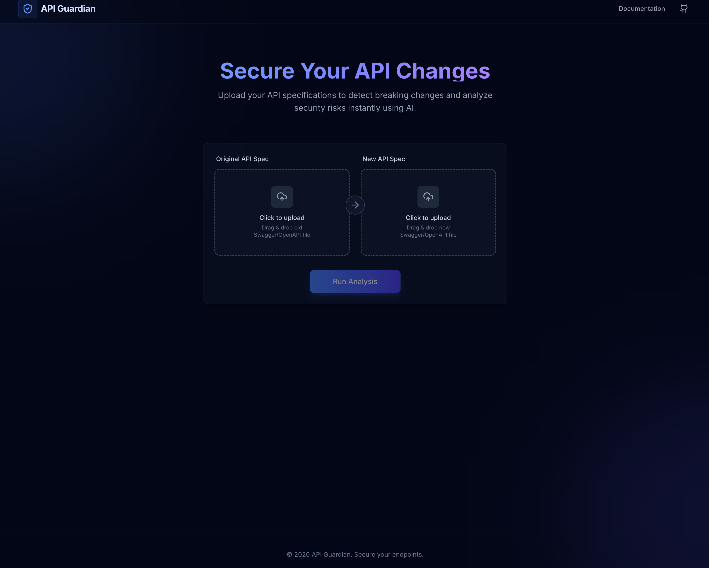
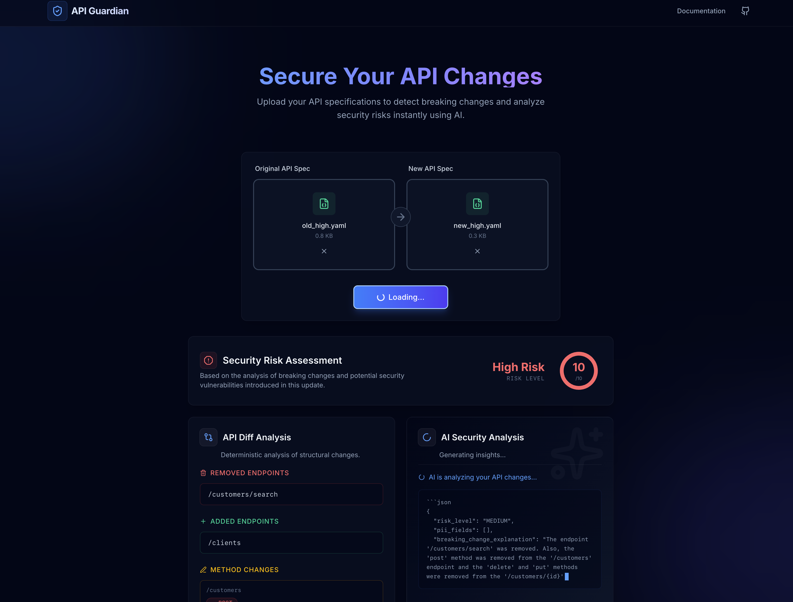
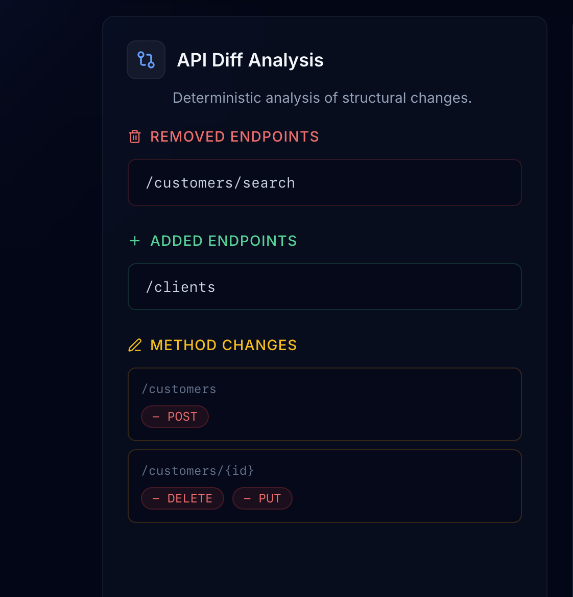
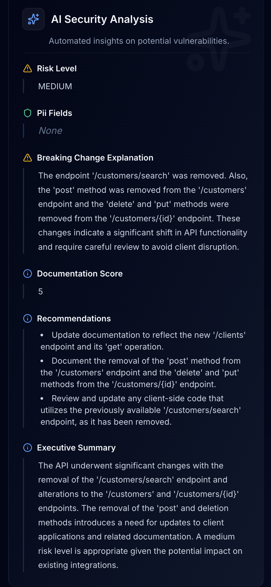

# API Guardian

A comprehensive API specification analysis tool that detects breaking changes, security risks, and inconsistencies between old and new API definitions. Combines deterministic diff analysis with AI-powered insights to help teams safely evolve their APIs.

## Overview

APIs evolve frequently, but teams often accidentally:
- Introduce breaking changes
- Expose sensitive fields
- Create inconsistent documentation
- Miss backward compatibility issues

**API Guardian** automates API change analysis using:
- **Diff Engine**: Deterministically detects removed endpoints, method changes, type changes, and required field modifications
- **AI Analysis**: Provides semantic review, security analysis, PII detection, documentation quality scoring, and executive summaries
- **Risk Scoring**: Quantifies the impact and severity of changes

## Features

✅ **Breaking Change Detection** - Automatically identifies removed endpoints, method changes, and type incompatibilities

✅ **Security Analysis** - AI-powered analysis for security vulnerabilities and PII exposure

✅ **Risk Scoring** - Quantified risk assessment for API changes

✅ **AI-Generated Insights** - Semantic review, documentation quality scoring, and suggested fixes

✅ **Streaming Analysis** - Real-time feedback with Server-Sent Events (SSE)

✅ **Local AI Support** - Use local Ollama models for complete privacy (no external API calls)

✅ **User-Friendly Interface** - Interactive web UI for uploading specs and viewing results

## Project Structure

```
API-Guardian/
├── client/                 # React + Vite frontend
│   ├── src/
│   │   ├── components/    # React components
│   │   ├── App.jsx
│   │   └── main.jsx
│   └── package.json
│
├── server/                 # Flask backend
│   ├── app.py             # Main Flask application
│   ├── diff_engine.py     # Diff logic
│   ├── ai_analyzer_local.py  # Local Ollama AI analyzer
│   ├── ai_analyzer.py     # External AI (Google Gemini)
│   ├── risk_scorer.py     # Risk calculation
│   ├── parser.py          # Spec parsing
│   ├── utils.py           # Utilities
│   └── requirements.txt   # Python dependencies
│
├── sample_data/           # Sample API specifications
│   ├── old_api.yaml
│   └── new_api.yaml
│
└── README.md
```

## Architecture

### Backend (Flask)
- **Framework**: Flask with CORS support
- **Spec Format**: YAML (OpenAPI specifications)
- **AI Modes**:
  - Local: Ollama (self-hosted, no API keys needed)
  - Cloud: Google Gemini API

### Frontend (React)
- **Framework**: React 19 with Vite
- **Styling**: Tailwind CSS
- **HTTP Client**: Axios
- **Animation**: Framer Motion

## Prerequisites

### System Requirements
- **Node.js** >= 16 (for client)
- **Python** >= 3.8 (for server)
- **Ollama** (optional, for local AI analysis)

### For Local AI Setup (Recommended)
1. **Install Ollama**: Download from [ollama.ai](https://ollama.ai)
2. **Pull a Model**: 
   ```bash
   ollama pull gemma2:2b  # or another model of your choice
   ```
3. Ollama runs on `http://localhost:11434` by default

## Installation & Setup

### 1. Clone the Repository

```bash
cd API-Guardian
```

### 2. Backend Setup

#### Install Python Dependencies
```bash
cd server
pip install -r requirements.txt
```

#### Configure Environment (Optional - only if using Gemini API)
```bash
# Create .env file in server/ directory
echo "GEMINI_API_KEY=your_api_key_here" > .env
```

**Note**: The app uses local Ollama by default. Only configure the `.env` file if you plan to use Google Gemini instead.

### 3. Frontend Setup

```bash
cd ../client
npm install
```

## Running Locally

### Step 1: Start Ollama (if using local AI)

Open a terminal and start the Ollama service:
```bash
ollama serve
```

You'll see output like:
```
Listening on 127.0.0.1:11434 (HTTP)
```

**Note**: Make sure you have a model pulled. Check with:
```bash
ollama list
```

If you don't have a model, pull one:
```bash
ollama pull gemma2:2b
```

### Step 2: Start the Backend Server

```bash
cd server
python app.py
```

You should see:
```
 * Running on http://127.0.0.1:5000
 * Debug mode: on
```

The backend will automatically use the local Ollama instance running on port 11434.

### Step 3: Start the Frontend Development Server

In a new terminal:
```bash
cd client
npm run dev
```

You should see:
```
VITE v5.x.x  ready in xxx ms

➜  Local:   http://localhost:5173/
➜  press h + enter to show help
```

### Step 4: Open in Browser

Navigate to `http://localhost:5173/` in your browser. You'll see the API Guardian interface ready to upload and analyze API specifications.

## Usage

1. **Upload Old Spec**: Upload your current/old API specification (YAML format)
2. **Upload New Spec**: Upload your updated API specification (YAML format)
3. **Analyze**: Click the analyze button to run the diff and AI analysis
4. **Review Results**:
   - **Breaking Changes**: See flagged breaking changes from the diff engine
   - **Risk Score**: View overall risk assessment
   - **AI Summary**: Read AI-generated insights and recommendations
   - **Suggested Fixes**: Get suggestions for resolving issues

## Configuration

### Using Local Ollama

Edit `server/ai_analyzer_local.py` to configure:

```python
OLLAMA_URL = "http://localhost:11434/api/generate"
MODEL_NAME = "gemma2:2b"  # Change to your model
```

**Available Ollama models**:
- `gemma2:2b` - Fast, lightweight
- `gemma3:4b` - Better quality, slightly slower
- `mistral:7b` - More capable, requires more resources
- `llama2:7b` - Popular, good balance

### Using Google Gemini API

To use Google Gemini instead of local Ollama:

1. Set your API key in `server/.env`:
   ```
   GEMINI_API_KEY=your_api_key_here
   ```

2. Update `server/app.py`:
   ```python
   # Change this line:
   from ai_analyzer_local import analyze_with_ai
   
   # To:
   from ai_analyzer import analyze_with_ai
   ```

3. Restart the backend server

## API Endpoints

| Method | Endpoint | Purpose |
|--------|----------|---------|
| `POST` | `/analyze` | Upload specs and get complete analysis |
| `POST` | `/analyze/stream` | Streaming analysis with real-time AI feedback |

## Sample Data

Test files are included in the `sample_data/` directory:
- `old_api.yaml` - Original API specification
- `new_api.yaml` - Updated API specification

You can use these to test the tool without creating your own specs.

## Screenshots


 



## Troubleshooting

### "Connection refused" to Ollama
- Ensure Ollama is running: `ollama serve`
- Check it's listening on `http://localhost:11434`
- Try: `curl http://localhost:11434/api/tags` to verify

### Model not found
```bash
ollama pull gemma2:2b
```

### Port already in use
- Backend (port 5000): Kill process on port 5000
- Frontend (port 5173): Vite will auto-increment port
- Ollama (port 11434): Check if another Ollama instance is running

### API spec not parsing
- Ensure specs are valid YAML or JSON
- Check spec format is OpenAPI 3.0 or Swagger 2.0
- Validate with: https://www.yamllint.com/

## Development

### Backend Development
```bash
cd server
python app.py  # Runs with Flask debug mode
```

### Frontend Development
```bash
cd client
npm run dev    # Hot reload enabled
npm run build  # Production build
```

### Linting
```bash
cd client
npm run lint
```

## Tech Stack

**Frontend:**
- React 19
- Vite
- Tailwind CSS
- Framer Motion
- Axios

**Backend:**
- Python 3.8+
- Flask
- PyYAML
- Ollama (local AI)
- Google Generative AI (optional, cloud AI)

**AI:**
- Local: Ollama
- Cloud: Google Gemini API (optional)


## Support

For issues or questions:
1. Check the troubleshooting section above
2. Review the sample data in `sample_data/`
3. Check Flask/Ollama logs for errors
4. Ensure all prerequisites are installed
